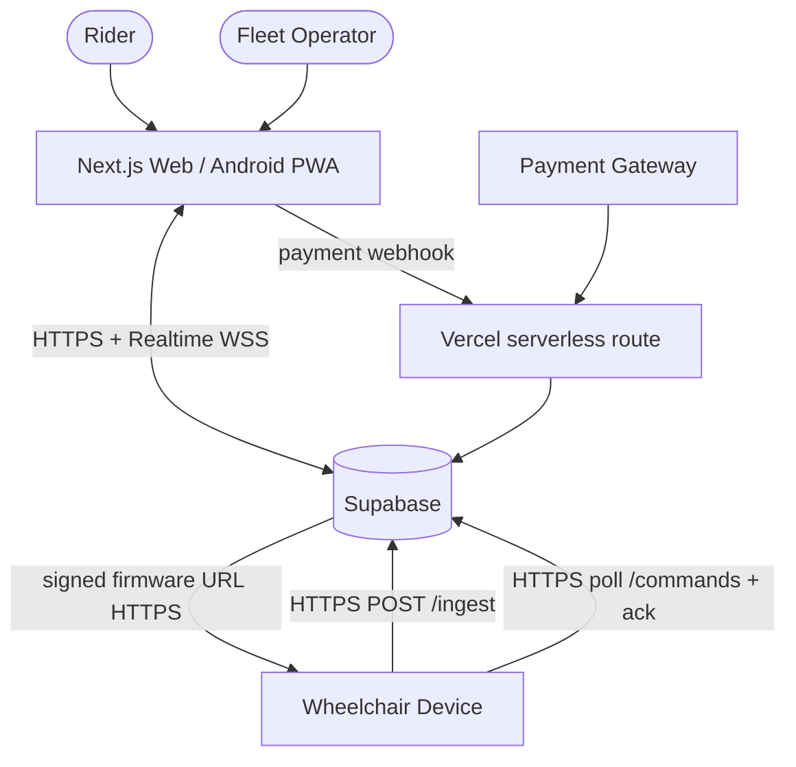
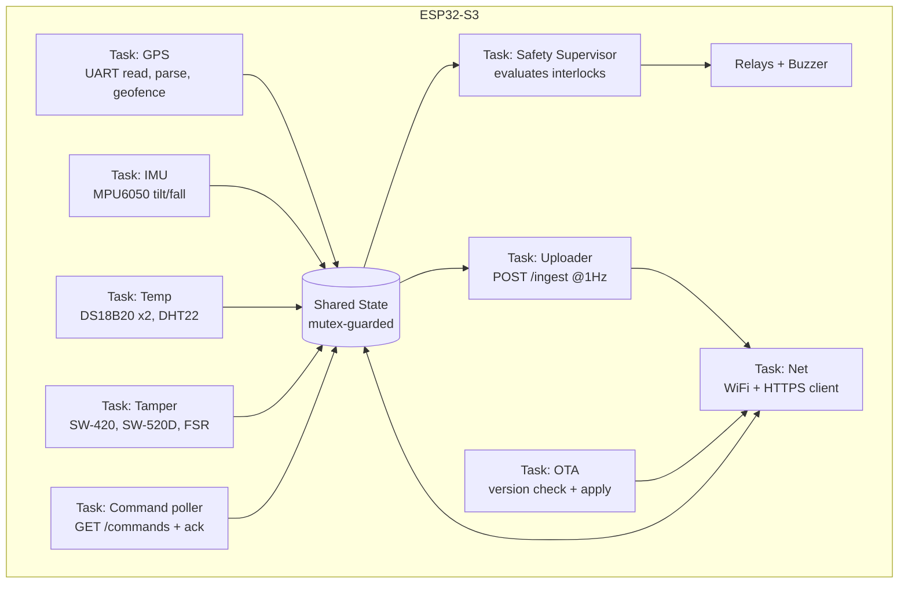

# Architecture

## 1. Context (who talks to whom)



**Rule:** the device talks ONLY to Supabase (over HTTPS); the website talks ONLY to Supabase
(reads/RPC + Realtime); the website never talks to a device directly. Supabase + the Vercel
webhook are the sole authority for sessions, payments, auth, and command issuing. This keeps the
device dumb/safe and the trust boundary clean (SECURITY.md).

## 2. Cloud components (Supabase + Vercel)

```mermaid
flowchart LR
  subgraph Supabase
    ING[Edge Fn: ingest\nvalidate + HMAC + rate-limit + downsample]
    CMDS[Edge Fn: commands\ndevice poll + ack]
    CRON[Scheduled Fn (pg_cron)\nrental timers → insert commands]
    DB[(Postgres\ndevice_state, telemetry_history,\nevents, rentals, payments, commands, profiles, wheelchairs)]
    RT[Realtime publications]
    AUTH[Auth + RLS]
    ING --> DB
    CMDS <--> DB
    CRON --> DB
    DB --> RT
  end
  subgraph Vercel
    WEBHOOK[/api/payments/webhook\nverify signature → mark paid]
    SSR[Next.js server actions / route handlers]
  end
  WEBHOOK --> DB
  SSR --> DB
```

- **`ingest` Edge Function:** the only writer of device data. Validates the device key + HMAC,
  checks the API.md JSON, rate-limits, **upserts `device_state`** and **appends a downsampled
  row to `telemetry_history`**, and inserts `events`.
- **`commands` Edge Function:** device polls pending commands (device-key scoped) and posts acks.
- **Scheduled function (pg_cron):** runs every ~10–30 s, finds sessions crossing the warn/expiry
  thresholds, updates `rentals.state`, and inserts `WARN_EXPIRY` / `END_SESSION` commands. This is
  the "rental engine" — Supabase, not a long-running server.
- **Realtime:** publishes row changes on `device_state`, `events`, `rentals`, `commands` to the
  website over WebSocket.
- **Auth + RLS:** Supabase Auth issues JWTs (roles `rider` / `operator`); Row Level Security scopes
  every table (SECURITY.md).
- **Vercel:** hosts the Next.js site/PWA and the payment webhook route (verifies the gateway
  signature, marks the payment paid, which the cron/logic turns into an UNLOCK command).
- **Desired vs reported state:** `device_state` carries reported telemetry plus the desired
  fields (`locked`, `speed_limit`, `geofence`); on reconnect the device re-reads/receives these so
  it never resumes in the wrong state.

## 3. Firmware architecture (ESP32-S3, FreeRTOS)

Independent tasks so one slow/blocking subsystem never stalls safety or connectivity. Shared state
is mutex-guarded.



### Task responsibilities & rates
| Task | Rate | Responsibility |
|------|------|----------------|
| GPS | continuous read, 1 Hz eval | parse NMEA, compute speed, on-device circular geofence |
| IMU | 50 Hz | read MPU6050, tilt angle, fall/over-tilt detection |
| Temp | 0.5 Hz | DS18B20 motor + battery, DHT22 ambient |
| Tamper | 20 Hz | debounce SW-420 / SW-520D / FSR; armed only when LOCKED |
| **Safety Supervisor** | 20 Hz | **highest priority** — turns interlocks into relay/buzzer actions |
| Net | event | WiFi + HTTPS (TLS) client, reconnect/backoff |
| Uploader | 1 Hz | serialize shared state → `POST /ingest` (telemetry + events) |
| Command poller | every `COMMAND_POLL_MS` | `GET /commands?pending`, execute, `POST ack` |
| OTA | on command / hourly | check version, pull + verify + flash |

### Safety Supervisor priority (overrides rental logic)
1. **Fall / dangerous tilt** → cut motion relay (graceful), siren, `FALL` event.
2. **Over-temperature** (motor/battery > threshold) → cut main-power relay, siren, event.
3. **Tamper while LOCKED** → siren, `TAMPER` event.
4. **Geofence breach** → warn (buzzer chirp) + event; policy action per config.
5. **Over-speed** → warn + cutoff (HARDWARE.md gap on true limiting).
6. **Rental state** (LOCKED/ACTIVE) → motion relay enabled only when ACTIVE + safe.

> Safety always wins over commercial state: a paid session never overrides a fall or over-temp cutoff.

## 4. Data flow examples

**Telemetry (1 Hz):** sensors → shared state → Uploader → `POST /ingest` → Edge Function upserts
`device_state` + appends `telemetry_history` → Realtime → website map updates.

**Unlock after payment:** rider pays → gateway → Vercel `/api/payments/webhook` (verify signature)
→ mark `payments` PAID → `rentals` → ACTIVE → insert `UNLOCK` (+ `SET_SPEED_LIMIT`, `SET_GEOFENCE`)
into `commands` → device polls, enables motion relay, posts `ack` → Realtime shows "Unlocked".

**Reconnect re-assert:** device rejoins WiFi → resumes uploads; it re-reads its desired fields from
`device_state` (locked/speed_limit/geofence) and any still-pending commands, so it can never come
back in the wrong state.
