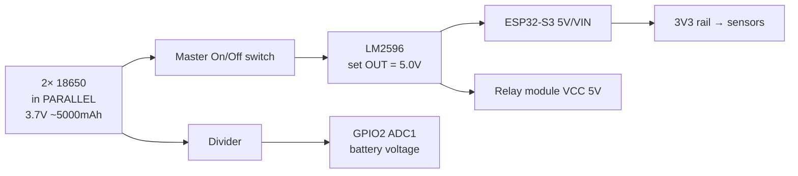

# Hardware

## 1. Bill of materials → feature mapping

Every component you bought, and the feature it serves.

| Component (from cart) | Qty | Used for | Feature |
|-----------------------|-----|----------|---------|
| ESP32-S3-WROOM-1 dev board | 1 | Main controller, WiFi, OTA | all |
| NEO-M8N GPS | 1 | Position, speed, satellites | 4 |
| MPU6500 IMU | 1 | Tilt angle, fall detection, tamper/shock, motion | 9, 10 |
| DS18B20 probe (waterproof) | 1 | **Battery** temperature | 2 |
| 2-channel relay module | 1 | CH1 = main power, CH2 = motion lock | 1, 13 |
| Mini piezo buzzer | 1 | Expiry warning, tamper siren, alerts | 10, 13 |
| LM2596 (with display) | 1 | Battery → regulated 5 V | power |
| 18650 cells | 2 (parallel) | Electronics battery | power |
| 18650 single holders | 2 | Hold the 2 cells (parallel) | power |
| Li-ion charger (2-slot) | 1 | Recharge cells (bench) | power |
| Multimeter | 1 | Set LM2596 to 5.0 V, debug | tool |
| Breadboards / jumpers | — | Prototyping | build |
| Soldering kit | 1 | Permanent connections | build |
| On/Off switch (2-pin) | 1 | Physical master power switch | 1 |

**Not used in this phase (no wheelchair role):** Soil Moisture Sensor — keep as a spare.
**Spare LM2596 (plain)** and the **4-cell holders** are not needed for the 2-cell parallel
pack; keep as spares.

## 2. ESP32-S3 pin map

> All pins below are safe on the ESP32-S3-WROOM-1. Pins matching the firmware's `config.h`.

| Peripheral | Signal | GPIO | Bus / Notes |
|------------|--------|------|-------------|
| NEO-M8N GPS | RX (← GPS TX) | 16 | UART1 @ 9600 |
| NEO-M8N GPS | TX (→ GPS RX) | 17 | optional |
| MPU6500 | SDA | 5 | I²C @ 400 kHz |
| MPU6500 | SCL | 6 | I²C (shared) |
| DS18B20 | DATA | 4 | **OneWire bus** — battery temperature probe; 4.7 kΩ pull-up to 3V3 |
| Battery V-sense | analog | 1 | ADC1 (GPIO 1), via divider |
| Relay CH1 (main power) | IN1 | 12 | drive logic |
| Relay CH2 (motion lock) | IN2 | 13 | drive logic |
| Buzzer 1 | + | 10 | PWM tone / active buzzer |
| Buzzer 2 | + | 11 | PWM tone / active buzzer |
| Status LED | — | 21 | onboard status LED |

## 3. Wiring per subsystem

- **GPS:** VCC→3V3, GND→GND, TXD→GPIO16, RXD→GPIO17.
- **MPU6500:** VCC→3V3, GND→GND, SDA→5, SCL→6. (Address 0x68.)
- **DS18B20:** VCC→3V3, GND→GND, DATA→GPIO4, shared 4.7 kΩ pull-up between DATA and 3V3.
- **Relay module:** VCC→**5 V** (from LM2596), GND→GND, IN1→GPIO12, IN2→GPIO13.
- **Buzzer:** +→GPIO10 / GPIO11, −→GND.

## 4. Power subsystem

- Wire the two 18650s **in parallel** (+ to +, − to −): 3.7 V nominal, double capacity.
  **Match their voltage with the multimeter before pairing** (used cells are mismatched).
- Set LM2596 output to **exactly 5.0 V with the multimeter BEFORE** connecting the ESP32.
- Battery sense divider: e.g. R1=100 kΩ (top), R2=100 kΩ (bottom) → halves 4.2 V to 2.1 V,
  safely inside ADC1's range. Firmware multiplies back ×2 and calibrates against the meter.

## 5. Known hardware gaps (be explicit — Claude Code cannot invent hardware)

These features are **partially actuatable** with the current BOM. Document the limit and
implement the safe subset; flag the extra part needed for full function.

1. **Speed *limiting* (Feature 5) and motion control:** there is **no motor controller / ESC
   / DAC** in the BOM. The 2-channel relay is **on/off only** — it cannot proportionally
   slow the chair. So:
   - *Implemented now:* monitor GPS speed; on over-speed → buzzer warning + (last resort)
     cut the motion relay. "Lock movement" = open the relay in the motor controller's
     **enable / key-switch line** (NOT the raw motor current — a 10 A relay can't switch
     a wheelchair motor).
   - *To do it properly later:* interface to the wheelchair's existing motor controller
     via PWM/0–5 V throttle override, or add a motor driver. Mark as a required add-on.
2. **"Graceful slow-down before stop":** without proportional control, the relay can only
   cut motion. Firmware should still implement the *logic* (a ramp-down command path) so
   that when a real controller is wired, it works — for now the ramp ends in a relay cut.
3. **Battery monitoring** is **voltage-only** (divider). No current sensor → no true SoC/SoH
   or current draw. Feature 3 is out of scope; voltage % is an estimate.
4. **Internet = WiFi** (Feature 7). No cellular modem in BOM → the chair must be in WiFi /
   hotspot range. 4G is a future add-on (the SIM7600 firmware variant already exists).

## 6. Relay-as-lock safety note

The relay must be wired **fail-safe**: a power loss or crashed MCU must leave the chair in
a **safe** state. Decide the convention and document it: e.g. motion relay **normally-open**
so loss of control = motion disabled (chair won't run away), but ensure this does not cause
an abrupt stop hazard at speed. This is a safety-critical wiring decision, not just code.
