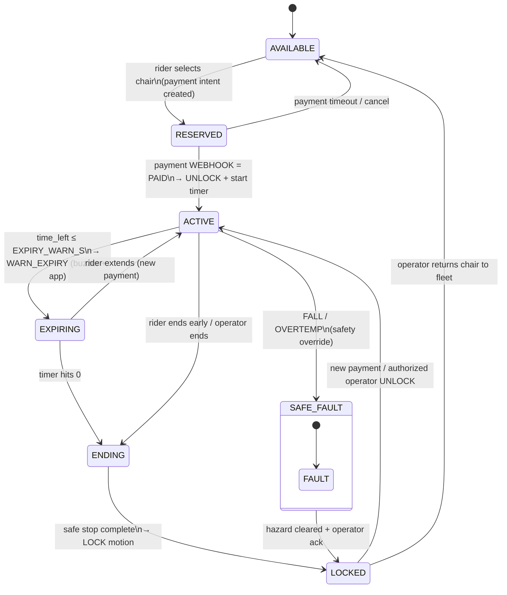
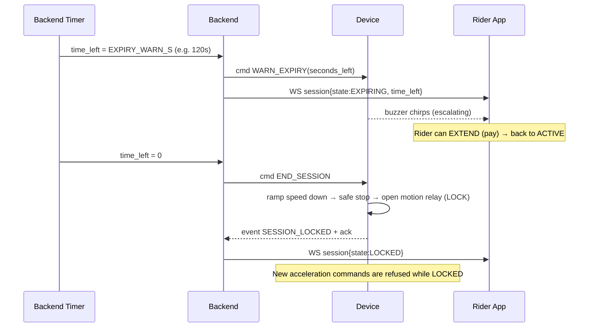
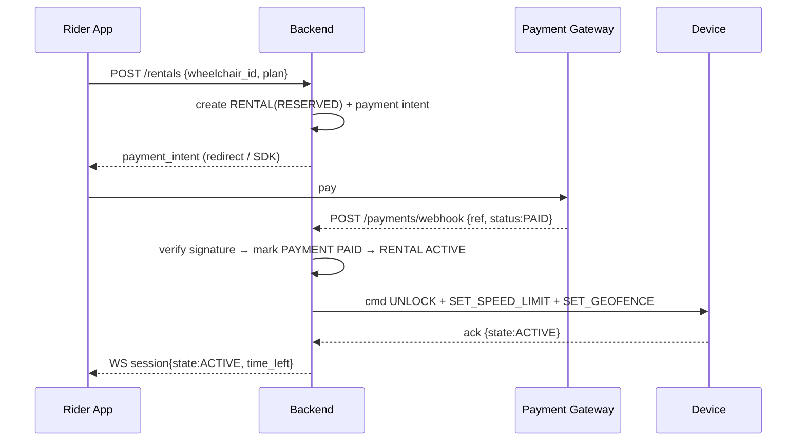

# Rental Session Control

This is the commercial heart of the system. The **backend owns the authoritative session
state**; the device mirrors a simplified version locally so it stays safe if the link drops.

## 1. Session state machine (backend authority)

### State meanings
| State | Power | Motion | Meaning |
|-------|-------|--------|---------|
| AVAILABLE | on | locked | idle in fleet, awaiting a rider |
| RESERVED | on | locked | rider committed, payment pending (short TTL) |
| ACTIVE | on | **unlocked** | paid, riding, timer counting down |
| EXPIRING | on | unlocked | within the warning window; buzzer + app banner |
| ENDING | on | ramping→stop | session over, performing safe stop |
| LOCKED | on | locked | stopped + locked; needs payment/operator to resume |
| SAFE_FAULT | per hazard | cut | safety interlock fired; overrides commercial state |

## 2. Expiry sequence (the required behavior)

**Required guarantees (from the brief):**
1. **Notify before expiration** — `WARN_EXPIRY` at `EXPIRY_WARN_S`; buzzer + app banner.
2. **Safe stop, then lock** — `END_SESSION` triggers ramp-down (or relay cut where no
   proportional control exists) → motion relay opens. Never an abrupt cut at speed if a
   real controller is present.
3. **No new acceleration while LOCKED** — device refuses motion-enabling commands unless
   state is ACTIVE.
4. **Reactivate only via payment or authorized unlock** — LOCKED → ACTIVE happens **only**
   on a verified payment webhook or an operator `UNLOCK` with a valid operator JWT.

> **Implementation:** the "Backend Timer" is a **Supabase scheduled function (pg_cron)** running
> every ~10–30 s. It finds sessions crossing the warn/expiry thresholds, updates `rentals.state`,
> and inserts `WARN_EXPIRY` / `END_SESSION` rows into `commands`, which firmware receives via
> `/ingest` responses and then acks.

## 3. Payment → unlock flow

- **Trust the webhook, not the client.** The chair unlocks on the *gateway's* signed
  webhook, never on a client claiming "I paid."
- **Payment adapter:** one interface, swappable providers.
  - `MockGateway` (dev/demo): instant PAID for testing the whole flow with no real money.
  - `JazzCash` / `Easypaisa` (Pakistan) or `Stripe` (intl) for production — needs a real
    merchant account; keep keys server-side only.
- **Idempotency:** webhooks can arrive twice — key on `provider_ref` so a session unlocks once.

## 4. Device-local fallback (link down)
The device keeps a minimal local view: `locked`, `session_end_ts`, `speed_limit`, geofence.
- If the link drops mid-session, the device keeps honoring the known `session_end_ts`
  (so a paid rider isn't stranded), runs the expiry sequence locally, and syncs on reconnect.
- If it boots with no server and no valid session → default **LOCKED** (fail-safe: a chair
  with unknown payment status must not be free to ride).

## 5. Safety interlocks vs. commercial state (priority)
Safety **always** overrides rental state (see ARCHITECTURE.md §3.1). Concretely:
- ACTIVE + FALL → SAFE_FAULT (motion cut) even though the rider paid.
- ACTIVE + OVERTEMP → SAFE_FAULT (power cut).
- LOCKED + TAMPER → siren + operator alert (motion already disabled).
- A `SAFE_FAULT` can only return to LOCKED after the hazard clears **and** an operator
  acknowledges — it never silently re-enables motion.
