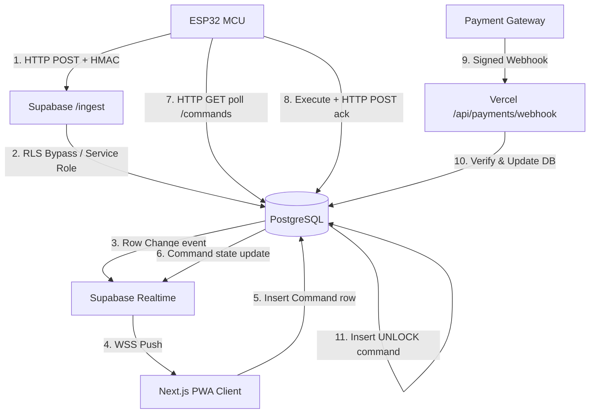

# System Understanding: Smart Rental Wheelchair IoT

This document outlines the architectural understanding, feature requirements, data flow, hardware boundaries, and critical design decisions for the Smart Rental Wheelchair IoT system.

---

## 1. System Overview & Architecture Tiers

The system is built on a modern IoT stack: **ESP32 → Supabase → Vercel**. It uses a "cloud-as-sole-authority" model to manage rentals, sessions, payments, and commands. The device never communicates directly with Vercel, and the client application never communicates directly with the hardware.

The architecture is divided into three tiers:

### Tier 1: The Device (Firmware)
*   **Hardware Platform:** ESP32-WROOM-32 (30-pin dev board) running PlatformIO with the Arduino core.
*   **Operating Model:** Multi-threaded FreeRTOS tasks coordinating sensor reads (GPS, IMU, temperature, motion state, vibration) and actuation (relays, buzzer, status LED).
*   **Connectivity:** WiFi only (HTTPS to Supabase Edge Functions).
*   **Auth/Security:** Performs HMAC-SHA256 signing of telemetry and event uploads using a per-device key. Verifies HMAC-SHA256 signatures of commands polled from the cloud.

### Tier 2: The Cloud (Supabase)
*   **Database:** PostgreSQL storing fleet tables, profiles, rentals, payments, events, latest device snapshots (`device_state`), and raw telemetry history (`telemetry_history`).
*   **Edge Functions:**
    *   `/ingest`: Decrypts, validates HMAC, rate-limits, upserts `device_state` (hot snapshot), appends downsampled telemetry to `telemetry_history`, and writes `events`.
    *   `/commands`: Handles device polling for pending commands and posts execution acks.
*   **Scheduled Engine (`pg_cron`):** Runs periodically to check for warnings/expiries, advances session states, and inserts commands (`WARN_EXPIRY`, `END_SESSION`).
*   **Realtime Pub/Sub:** Pushes live updates of `device_state`, `events`, `rentals`, and `commands` to client applications over WebSockets (WSS).
*   **Access Control:** Row Level Security (RLS) protects tables based on Supabase Auth JWT claims (e.g. `rider` vs. `operator`).

### Tier 3: The Client Application (Vercel)
*   **Frontend/PWA:** Next.js (App Router) client with an installable PWA shell.
*   **Live Map:** MapLibre GL / Leaflet map rendering vector tiles, performing marker clustering, and interpolating position updates between telemetry ticks at 60fps.
*   **Backend Serverless Routes:** `/api/payments/webhook` verifies gateway signatures, updates payment states to PAID, and schedules the `UNLOCK` command.

---

## 2. The 9 Core Features in Scope

| Feature | Subsystem / Hardware | Behavior Description |
| :--- | :--- | :--- |
| **F1: Remote Power ON/OFF** | Relay CH1 | Operator/app triggers `POWER_ON` / `POWER_OFF`. Powering off cuts main power to the controller and implicitly locks motion. |
| **F2: Temperature Monitoring** | DS18B20 ×2, DHT22 | Reads motor and battery temperatures (DS18B20) and ambient conditions (DHT22). Temp > 70°C (HOT) triggers main power relay cutoff (CH1), emits `OVERTEMP` event, and starts a siren. Recovery requires falling below 62°C (hysteresis). |
| **F4: GPS Tracking & Geofencing** | NEO-6M GPS | Publishes coordinates at 1 Hz. Computes haversine distance locally on-device. Exiting the geofence radius raises a `GEOFENCE_EXIT` event and chirps the buzzer; re-entering raises `GEOFENCE_ENTER`. |
| **F5: Speed Monitoring & Limiting** | NEO-6M GPS, Relay CH2 | Monitors speed at 1 Hz. Exceeding speed limit (default 6 km/h) triggers escalating buzzer warnings. Sustained overspeed (> 5s grace) triggers motion cutoff via CH2 relay and raises `OVERSPEED` event. |
| **F7: Internet Connectivity** | WiFi, HTTPS | Main WiFi link to Supabase Edge Functions. Uploads telemetry at 1 Hz as a heartbeat. Cloud flags device offline after 30s of silence. Re-fetching state on connection re-asserts locks, limits, and geofences. |
| **F9: Gyroscope & Tilt Detection** | MPU6050, SW-520D | Calculates pitch, roll, and tilt angles (complementary/Madgwick fusion). Tilt > 30° warns the rider. Tilt > 50° or free-fall signature triggers immediate motion cut (CH2), a siren, and a `FALL` event. SW-520D provides secondary digital tip confirmation. |
| **F10: Tamper Detection (Obsolete)** | None | (FSR and SW-420 sensors removed from physical layout; logic deactivated to prevent false alarms). |
| **F12: OTA Updates** | HTTPS, OTA Partition | Device receives signed OTA manifest command, downloads binary over HTTPS, verifies SHA-256 and public-key signature, checks that version is newer than current, and flashes. OTA is strictly blocked during active motion. |
| **F13: Rental Session Control** | State Machine, Relay CH2 | Start/stop rental sessions. Locks chair by default. Upon payment confirmation, unlocks CH2. Expiry warning at 120s left chirps buzzer and flashes banner. On timer hitting 0, ramps speed down, opens motion relay, and locks. |

---

## 3. Data Flow Architecture

---

## 4. Hardware Gaps & Software Mitigations

Because the current Bill of Materials (BOM) contains simple relays and lacks specialized controllers (e.g., motor driver, DAC, or cellular modem), the following constraints are handled in firmware:

1.  **Speed Limiting (F5):**
    *   *Gap:* The 2-channel relay is strictly binary (ON/OFF). We cannot control throttle or step down motor voltage proportionally.
    *   *Mitigation:* The firmware executes the state transition logic and throttle ramp-down sequences internally. When an overspeed limit is breached past the grace period, it opens the **motion relay (CH2)**.
    *   *Wiring:* CH2 must be wired to cut the wheelchair motor controller's **enable/throttle line** (a low-current signal), not the raw battery current (which would destroy the relay).
2.  **Graceful Slowdown (F13):**
    *   *Gap:* Ramping speed down on expiry is impossible with just a binary relay.
    *   *Mitigation:* The firmware runs a virtual deceleration ramp. During this ramp, the buzzer emits an escalating warning. Once the ramp reaches 0%, the CH2 relay opens. When proportional speed controllers are added in production, this software control path will already be fully integrated.
3.  **Battery Monitoring:**
    *   *Gap:* No shunt resistor or current sensor is in the BOM; we cannot calculate true State of Charge (SoC) using Coulomb counting.
    *   *Mitigation:* Battery percentage is estimated using a voltage-lookup curve from the voltage divider input on GPIO35 (TODO: untested on bench).
4.  **Internet Connectivity:**
    *   *Gap:* No 4G/LTE cellular module is present.
    *   *Mitigation:* The system requires the ESP32 to connect to a local WiFi access point or a mobile hotspot.

---

## 5. Remaining Open Decisions & Proposed Solutions

Before writing feature code, we must align on the following engineering choices:

### Open Decision 1: Motion Relay Pin (Normally Open vs. Normally Closed)
*   **Context:** If power is cut or the MCU crashes, we must guarantee a fail-safe state.
*   **Proposed Solution:** **Normally Open (NO)** wiring. The relay must be energized (active low -> GPIO driven low) to allow motion. If power fails or the MCU crashes, the relay opens automatically and disables motion. This prevents dangerous runaways or unauthorized use when offline/unpaid.

### Open Decision 2: Local WiFi & Key Provisioning
*   **Context:** We must not commit SSID, WiFi password, or device key to the git repository.
*   **Proposed Solution:**
    *   Create a `firmware/include/private_config.h` (to be ignored by git).
    *   `config.h` will include `private_config.h` if it exists, falling back to dummy variables.
    *   For development, we write configurations directly into `private_config.h`. For production, we will read them from ESP32 Non-Volatile Storage (NVS) flashed during manufacturing.

### Open Decision 3: Cryptographic Signature for commands and OTA
*   **Context:** Security requires verified commands and binaries.
*   **Proposed Solution:**
    *   *Telemetry & Commands:* We will use **HMAC-SHA256** with the shared `DEVICE_KEY` because it is computationally lightweight and easy to verify in Edge Functions.
    *   *OTA binary:* We will use **ECDSA-SHA256** with a public key embedded in the firmware. We will use the ESP32's `mbedtls` library to verify signatures.

### Open Decision 4: Mock Payments Testing Flow
*   **Context:** We need a reliable way to test the end-to-end payment and unlock flow during development.
*   **Proposed Solution:** The Rider PWA will display a "Pay (Mock)" button. Clicking it calls Vercel `/api/payments/webhook` with a mock payload containing a randomly generated `provider_ref` and a reference to the active `rental_id`. The webhook verifies the request and executes the database operations, triggering the `UNLOCK` command.
